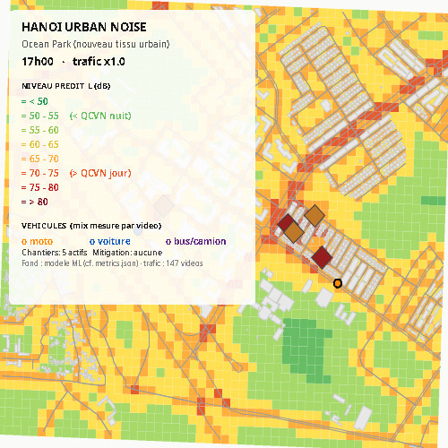
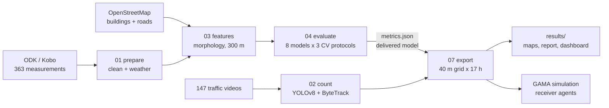

# Noise Modelling Hanoi

[](LICENSE)
[](LICENSE-DATA)
[](pyproject.toml)
[](tests/)

**What a low-cost smartphone protocol can and cannot establish about urban noise —
363 field measurements in Hanoi, and three negative results that hold up better
than the positive one.**



*Predicted level over Ocean Park at 17:00, in the GAMA simulation. 40 m grid,
delivered physical model, measured traffic flow. Colour bands are QCVN 26:2010
day and night references, shown descriptively — this study makes no compliance
claim.*

---

## Context and goal

Hanoi is dense, motorcycle-dominated and growing fast, and has little routine
noise monitoring. Professional sound level meters and commercial noise models are
out of reach for most local research budgets. So: **how far does a protocol built
from three consumer smartphones and open data actually get you?**

We ran a three-month campaign, built the full chain from field form to agent-based
simulation, and then evaluated it honestly enough to find out where it breaks.

## Research questions

1. Can urban morphology from OpenStreetMap predict measured noise at an
   **unmeasured location** in Hanoi?
2. Does a model trained in one city **transfer** to another?
3. Does vehicle **flow extracted from video** explain measured levels?
4. What can a smartphone protocol claim, given that it has **no absolute
   reference**?

**Out of scope:** night-time noise (10 measurements after 21:00), compliance
assessment against any standard, and any prediction outside the three measured
sites.

## Data

| Dataset | Size | Published | Licence |
|---|---|---|---|
| Field measurements | 363 points, 3 sites | **yes**, `data/processed/measurements.csv` | CC-BY-4.0 |
| Vehicle counts from video | 147 videos | **yes**, `data/processed/vehicle_counts.csv` | CC-BY-4.0 |
| Survey forms (XLSForm) | 2 forms | **yes**, `data/forms/` | CC-BY-4.0 |
| Traffic videos | 147, 6.0 GB | **no** — faces and plates, see ethics | not distributed |
| Raw Kobo exports | — | **no** — collector identities | not distributed |
| OpenStreetMap extract | 49 146 buildings | **no** — regenerable, dated snapshot | ODbL |
| Sunbird Urban Noise Uganda 61K | 61 k clips | **no** — gated upstream | [DOI](https://doi.org/10.1038/s41597-026-06658-w) |

No ethics review was requested for the video collection, and none is claimed.
Only non-identifying aggregates are released. Full statement:
[`docs/data-sources.md`](docs/data-sources.md).

## Method in brief



Every model is scored under three splits: 600 m spatial blocks, **buffered
leave-one-out with a 300 m exclusion** (the reference — it matches the feature
radius), and leave-one-site-out. The delivered model is picked **by code** under
the reference protocol and written into `metrics.json`; nothing downstream can
silently substitute another. Details: [`docs/methodology.md`](docs/methodology.md).

## Install

```bash
git clone https://github.com/Colauz/noise-modelling-hanoi
cd noise-modelling-hanoi
make setup          # pip install -e .

# `make` uses `python3`. Activate your environment first, or pass one:
#     make results PYTHON=.venv/bin/python
# Every target checks the package is importable and says so if it is not.
```

## Reproduce the results

```bash
make features       # OSM morphology, 300 m radius
make models         # 8 models x 3 CV protocols -> models/metrics.json
make results        # grid, maps, figures, tables
make report         # results/report/report.pdf
```

This runs from the two datasets shipped with the repository. You do **not** need
the raw Kobo export or the 6 GB of video. `make features` needs the OSM extract —
see [`docs/data-sources.md`](docs/data-sources.md).

For the simulation, open `simulation/gama/hanoi_noise.gaml` in
[GAMA](https://gama-platform.org) and run `hanoi_noise_sim`.

## Repository layout

| Path | What |
|---|---|
| `data/` | Two published datasets and the survey forms; raw data stays local |
| `src/noise_hanoi/` | The importable core: paths, parameters, features |
| `scripts/` | `01_`…`11_`, numbered in execution order |
| `notebooks/` | Exploration and narrative, outputs stripped |
| `models/` | Fitted artefacts and `metrics.json`, the source of every published number |
| `simulation/gama/` | The agent-based model and the GIS inputs it reads |
| `results/` | Figures, maps, tables, the 8-page report and the dashboard |
| `docs/` | Methodology, data sources, metrology, negative results, handover |
| `tests/` | Aimed at the failures this project actually had |

## Main results

**The three negative results are the contribution.**

**1. A three-parameter physical law beats every learned model we built.** The
delivered model is a line-source attenuation kernel,
`E = A_hw/d_hw + A_res/d_res + B`.

| Model | Block-CV 600 m | **Buffered LOO** | Leave-one-site-out |
|---|---|---|---|
| log(dist_road), 2 parameters | 0.221 | 0.200 | 0.189 |
| **Physical kernel, 3 parameters — delivered** | 0.255 | **0.246** | **0.222** |
| LightGBM v1 (6 features) | 0.304 | 0.137 | 0.029 |
| Hybrid (physics + ML residual) | **0.395** | 0.123 | 0.035 |

The ranking **inverts** between the permissive split and the strict ones. The
hybrid this team had itself recommended is tested and rejected, not deferred. The
learned residual is computed at every run and deliberately **not applied**.

**2. Cross-city transfer fails.** A morphology→noise model pretrained on Uganda
scores R² < 0 on Hanoi, even with convention-invariant features. Local
measurement is a prerequisite, not a refinement.

**3. Vehicle flow does not explain the levels.** Non-negative energy regression on
147 matched videos returns zero coefficients for motorcycles and cars. Speed and
source–receiver distance are not observable from a non-georeferenced camera.

Full tables with baselines, ablation and bootstrap CIs:
[`models/model_comparison.md`](models/model_comparison.md) ·
[`docs/negative-results.md`](docs/negative-results.md).

## Known limitations

- **The instrument is a smartphone application, not a sound level meter.** Levels
  were read from Decibel X on three consumer handsets — not from a class 1 or
  class 2 instrument, which is what QCVN 26:2010 and TCVN 7878-2:2010 require.
  Consumer smartphone measurement is known to depart from reference instruments by
  several decibels, in a way that depends on handset, OS and level, and that is not
  a constant offset. This governs the uncertainty of every number below.
  [`docs/metrology.md`](docs/metrology.md)
- **Levels are relative, not absolute.** The three phones were cross-calibrated
  against each other, never against a reference instrument. A bias common to all
  three is invisible in the data by construction. Contrasts between places and
  hours are supported; absolute values are indicative and reported with a bounded
  bias interval.
- **The target is `L_A,25s`**, a 20–30 s A-weighted level — not a certified
  `L_Aeq`, `L_den` or `L_night`. No compliance claim is made anywhere.
- **The night is not sampled.** 10 measurements after 21:00, none 00:00–05:00.
- **The vehicle detector is unvalidated** against manual counts. Modal shares must
  not be published until it is.
- **R² ≈ 0.25** is modest. It is the figure that survives a split excluding the
  feature support; larger numbers here do not.
- **An earlier R² = 0.45 was withdrawn** in August 2026 — it came from a
  cross-validation grouped on cells smaller than the feature radius. See
  [`docs/audit/scientific-audit.md`](docs/audit/scientific-audit.md).

## Future work

A **real propagation kernel (CNOSSOS-EU, via NoiseModelling)** is the indicated
next step, not an optional extra: if a two-parameter distance term already beats a
six-variable gradient boosting model, then physical propagation corrected by a
locally learned residual is the architecture the data points at. Then: validate
the detector, and repeat the campaign with a reference instrument to anchor the
absolute scale. [`docs/handover.md`](docs/handover.md)

## Citation

See [`CITATION.cff`](CITATION.cff). Some author metadata is still marked
`[TO CONFIRM]`; those fields are deliberately unfilled rather than guessed.

## Team

Laurian Jamin and Lucas Zborowski, research interns, ISIMA (Clermont-Ferrand,
France), at [AFFILIATION TO CONFIRM — CEI or COSMOS Lab], VinUniversity, Hanoi,
June–August 2026. Supervised by Doanh Nguyen-Ngoc. With Nguyen Thanh Quang,
VinUniversity.

We reproduce and build on the Sunbird Urban Noise Uganda 61K dataset:
Nsumba et al., *Scientific Data* (2026),
[10.1038/s41597-026-06658-w](https://doi.org/10.1038/s41597-026-06658-w).
Road and building geometry © OpenStreetMap contributors, ODbL.

## Licence

Code MIT ([`LICENSE`](LICENSE)) · data, documentation and figures CC-BY-4.0
([`LICENSE-DATA`](LICENSE-DATA)).
